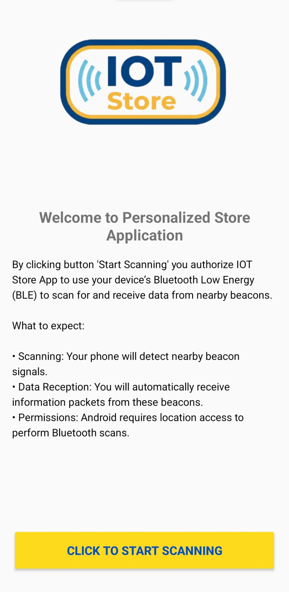
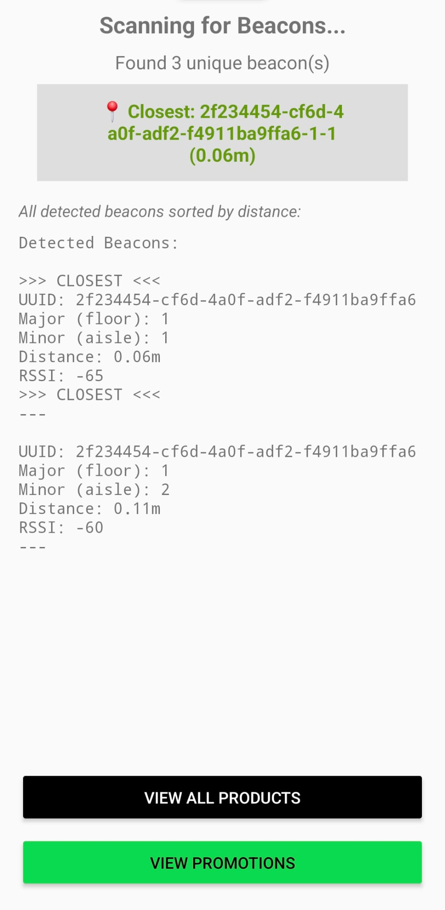
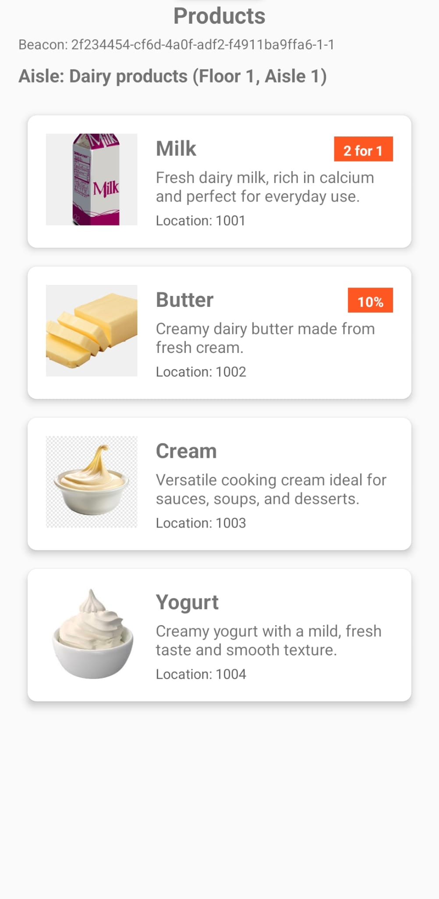
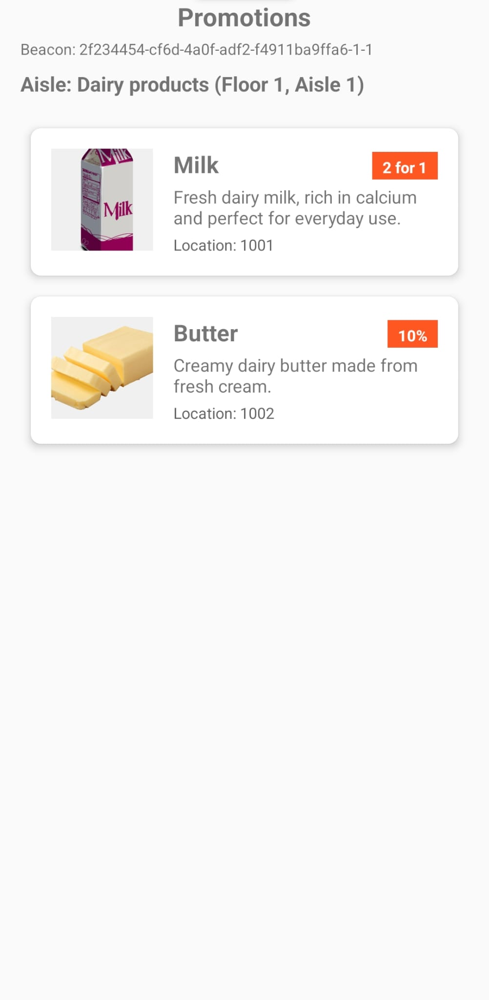

🛒 Personalized Store Application (IoT)
A modern Android application designed to enhance the retail experience through proximity awareness. The app utilizes Bluetooth Low Energy (BLE) to detect iBeacons, automatically serving personalized product lists and promotional offers based on the user's precise location within a physical store.

✨ Features
Proximity Detection: Real-time scanning for iBeacons to identify floor levels and specific aisles.

Contextual UI: Automatically updates product feeds as you move through different store sections (e.g., Dairy, Snacks).

IKEA-Inspired Branding: High-contrast Blue and Yellow design system for a professional and accessible retail feel.

Smart Promotions: A dedicated "Promotions" view that filters for items currently on sale in your immediate vicinity.

Glide Integration: Efficiently renders product images with a robust placeholder system for a smooth user experience.

📱 App Walkthrough

Welcome & Authorization	

Beacon Scanning
	

Dynamic Product List Filtered by Floor & Aisle

🛠 Tech Stack
Frontend: Kotlin, ConstraintLayout, ViewBinding, Glide.

IoT: AltBeacon Library (iBeacon protocol).

Backend: Flask (Python) REST API.

Database: MySQL (Relational schema for Stores, Aisles, and Products).

🚀 Getting Started
🖥️ Backend Setup (Required)

The app fetches data from a local server. You must set this up before the Android app can display products.

Database: Import iot_store.sql into your MySQL instance.

Bash
mysql -u root -p < iot_store.sql
API: Install dependencies and run the Flask server.

Bash
pip install flask mysql-connector-python
python API.py
The API will start at http://192.168.0.184:5001.

📱 Android Setup

Open the project in Android Studio.

Update the BASE_URL in MockDataSource.kt to match your local machine's IP:

Kotlin
// Line 11
private const val BASE_URL = "http://192.168.0.184:5001" 
Ensure your device/emulator has Bluetooth and Location enabled.

🛠 How it Works: The IoT Logic
The application maps Beacon data to the physical store layout stored in the MySQL database:

UUID: Identifies the specific Store.

Major Value: Identifies the Floor.

Minor Value: Identifies the Aisle ID.

When a beacon is detected, the app calls the API: GET /api/products?floor=1&aisle_id=1&mode=promo

Promotional View

Items with active discounts (like the "2 for 1" Milk) are highlighted in the Promotions screen:

 

<em>The Promotions view only displays items tied to the <code>Promotion</code> table.</em> 

📝 License
This project is part of an IoT academic course. Distributed under the MIT License.

Ready to share?

Since you already have the images in the screenshots folder, this README is now plug-and-play. Would you like me to help you write a GitHub Actions script to automatically check your Kotlin code for errors every time you push?
## Authors

- [@dsoeliem84](https://github.com/dsoeliem84/)
- [@achyuth03](https://github.com/achyuth03)
- [@estellenords](https://github.com/estellenords)

